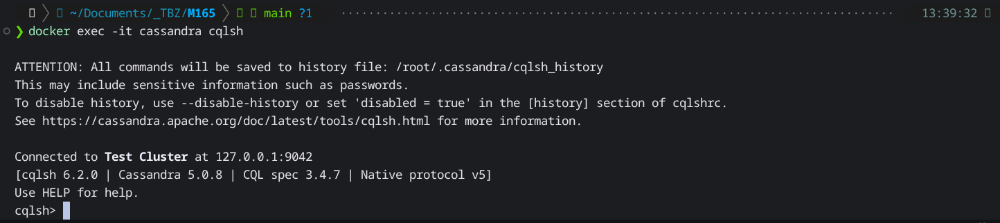
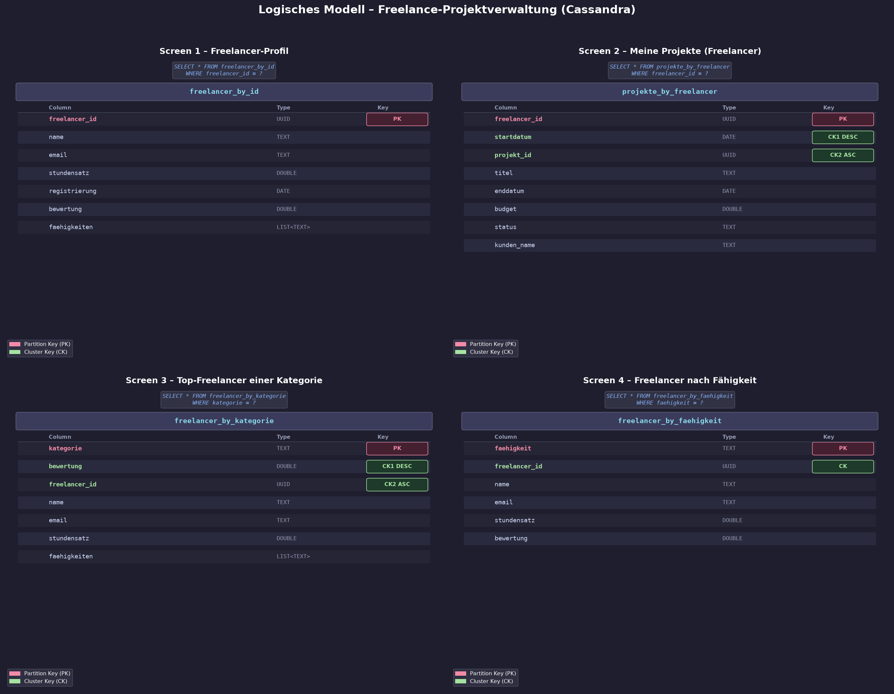
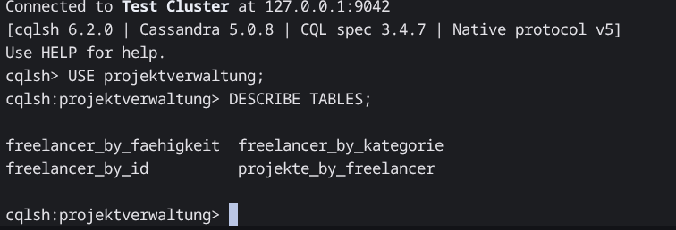

# KN-C-01: Installation und Datenmodellierung für Cassandra

**Thema:** Freelance-Projektverwaltung  
**Konzeptionelles Modell:** gleich wie KN-M-02

---

## A) Installation / Account erstellen

Cassandra läuft via Docker:

```powershell
docker pull cassandra:latest
docker run --name cassandra -p 9042:9042 -p 9160:9160 -d cassandra:latest
```

Nach ca. 1–2 Minuten mit cqlsh verbinden:

```powershell
docker exec -it cassandra cqlsh
```



---

## B) Logisches Modell für Cassandra

### Grundprinzip

In Cassandra gibt es keine JOINs. Stattdessen wird **pro Abfrage eine eigene Tabelle** erstellt. Redundanzen sind dabei explizit erwünscht. Die Modellierung beginnt deshalb nicht bei den Daten, sondern bei den **Screens / Anwendungsfällen**.

---

### Screens und benötigte Daten

#### Screen 1 – Freelancer-Profil

**Szenario:** Ein Besucher öffnet das Profil eines Freelancers und sieht alle seine Details (Name, Email, Stundensatz, Bewertung, Fähigkeiten).

**Abfrage:** `SELECT * FROM freelancer_by_id WHERE freelancer_id = ?`

| Spalte | Typ | Key |
|--------|-----|-----|
| **freelancer_id** | UUID | **Partition Key** |
| name | TEXT | |
| email | TEXT | |
| stundensatz | DOUBLE | |
| registrierung | DATE | |
| bewertung | DOUBLE | |
| faehigkeiten | LIST\<TEXT\> | |

**Begründung:** Jeder Freelancer hat eine eigene Partition (1 Datensatz pro Partition). Kein Cluster Key nötig, da pro Partition nur ein Dokument existiert.

---

#### Screen 2 – Meine Projekte (Freelancer-Sicht)

**Szenario:** Ein Freelancer meldet sich an und sieht alle Projekte, an denen er beteiligt ist, sortiert nach Startdatum (neuste zuerst).

**Abfrage:** `SELECT * FROM projekte_by_freelancer WHERE freelancer_id = ?`

| Spalte | Typ | Key |
|--------|-----|-----|
| **freelancer_id** | UUID | **Partition Key** |
| **startdatum** | DATE | *Cluster Key 1 (DESC)* |
| **projekt_id** | UUID | *Cluster Key 2 (ASC)* |
| titel | TEXT | |
| enddatum | DATE | |
| budget | DOUBLE | |
| status | TEXT | |
| kunde_id | UUID | |

**Begründung:** Alle Projekte eines Freelancers landen in einer Partition. `startdatum DESC` sortiert die neusten Projekte oben. `projekt_id` stellt Eindeutigkeit sicher, falls zwei Projekte am gleichen Tag starten.

---

#### Screen 3 – Top-Freelancer einer Kategorie

**Szenario:** Ein Kunde sucht die besten Freelancer in einer bestimmten Kategorie (z.B. "Webentwicklung"), sortiert nach Bewertung (beste zuerst).

**Abfrage:** `SELECT * FROM freelancer_by_kategorie WHERE kategorie = ?`

| Spalte | Typ | Key |
|--------|-----|-----|
| **kategorie** | TEXT | **Partition Key** |
| **bewertung** | DOUBLE | *Cluster Key 1 (DESC)* |
| **freelancer_id** | UUID | *Cluster Key 2 (ASC)* |
| name | TEXT | |
| email | TEXT | |
| stundensatz | DOUBLE | |
| faehigkeiten | LIST\<TEXT\> | |

**Begründung:** Alle Freelancer einer Kategorie sind in einer Partition. `bewertung DESC` sortiert die bestbewerteten Freelancer direkt an erster Stelle — ideal für eine Suchseite. `freelancer_id` stellt Eindeutigkeit sicher, falls zwei Freelancer die gleiche Bewertung haben.

---

#### Screen 4 – Freelancer nach Fähigkeit

**Szenario:** Ein Kunde sucht alle Freelancer mit einer bestimmten Fähigkeit (z.B. "React").

**Abfrage:** `SELECT * FROM freelancer_by_faehigkeit WHERE faehigkeit = ?`

| Spalte | Typ | Key |
|--------|-----|-----|
| **faehigkeit** | TEXT | **Partition Key** |
| **freelancer_id** | UUID | *Cluster Key* |
| name | TEXT | |
| email | TEXT | |
| stundensatz | DOUBLE | |
| bewertung | DOUBLE | |

**Begründung:** Alle Freelancer mit der gleichen Fähigkeit sind in einer Partition. `freelancer_id` als Cluster Key macht jeden Eintrag eindeutig.

---

### Visuelles Modell



### Zusammenfassung der Tabellen

```
freelancer_by_id          PK: freelancer_id
projekte_by_freelancer    PK: freelancer_id   CK: startdatum DESC, projekt_id
freelancer_by_kategorie   PK: kategorie       CK: bewertung DESC, freelancer_id
freelancer_by_faehigkeit  PK: faehigkeit      CK: freelancer_id
```

---

## C) Physisches Modell für Cassandra

Script: [C_create_physical.cql](C_create_physical.cql)

```powershell
# Ausführen via cqlsh:
docker exec -i cassandra cqlsh < C_create_physical.cql
```


