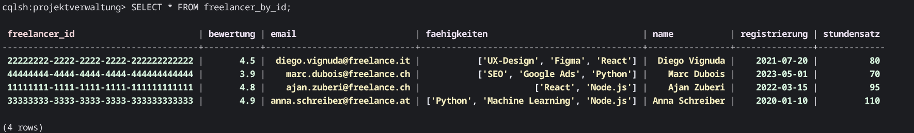
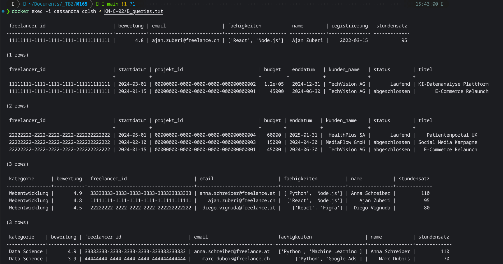
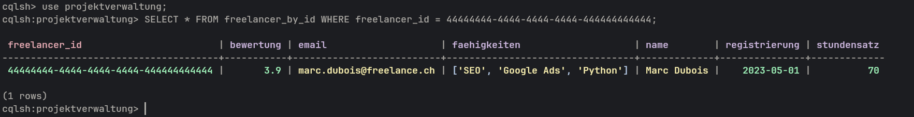
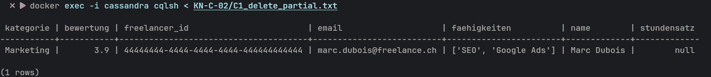
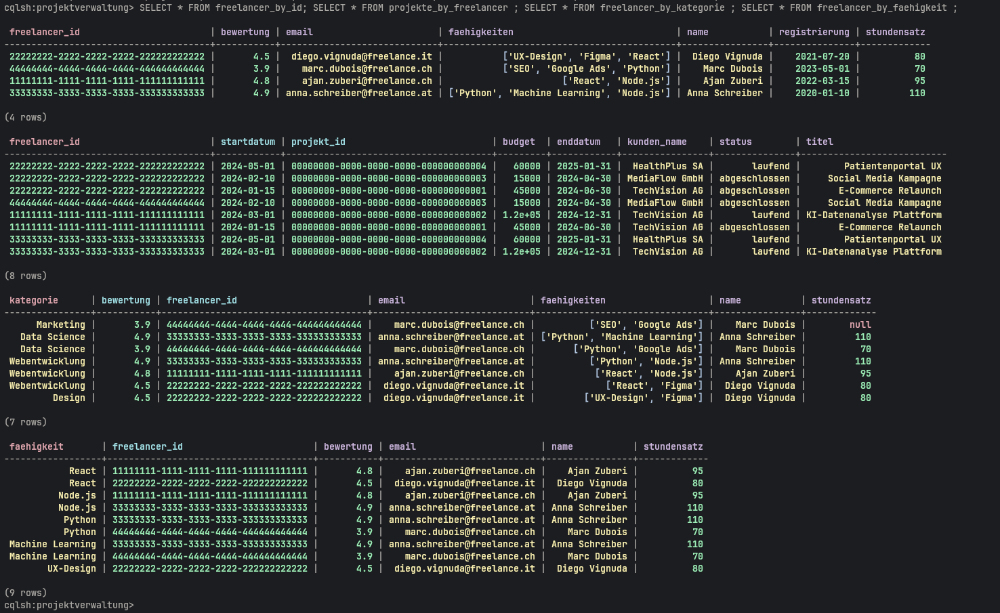
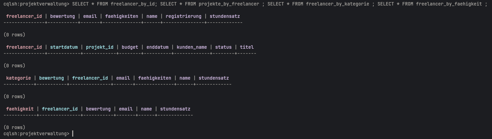
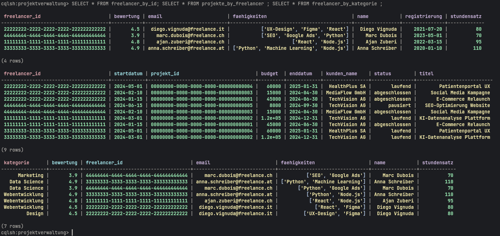
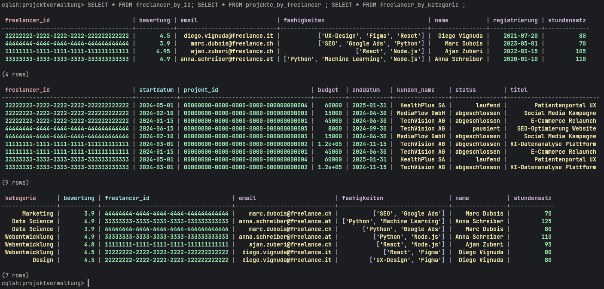

# KN-C-02: Datenabfrage und -Manipulation

**Keyspace:** `projektverwaltung`  
**Voraussetzung:** KN-C-01 (physisches Modell) muss ausgeführt worden sein.

---

## A) Daten hinzufügen – `A_insert.txt`

Pro Tabelle 3–5 Zeilen. Pro Partition Key mehrere Datensätze sichergestellt:

| Tabelle | Partition Key | Zeilen pro Partition |
|---------|---------------|----------------------|
| `freelancer_by_id` | `freelancer_id` | 1 (kein CK → eine Partition pro Freelancer) |
| `projekte_by_kunde` | `kunde_id` | kunde_a: 3, kunde_b: 2, kunde_c: 2 |
| `projekte_by_status` | `status` | laufend: 4, abgeschlossen: 2, pausiert: 1 |
| `freelancer_by_faehigkeit` | `faehigkeit` | React: 2, Node.js: 2, Python: 2, ML: 2 |

---

## B) Daten abfragen – `B_queries.txt`

Die 4 Abfragen entsprechen den Screens aus KN-C-01:

| Screen | Tabelle | WHERE |
|--------|---------|-------|
| Freelancer-Profil | `freelancer_by_id` | `freelancer_id = ...` |
| Projekte eines Kunden | `projekte_by_kunde` | `kunde_id = ...` |
| Projekte nach Status | `projekte_by_status` | `status = 'laufend'` / `'abgeschlossen'` |
| Freelancer nach Fähigkeit | `freelancer_by_faehigkeit` | `faehigkeit = 'React'` / `'Python'` |

---

## C) Daten löschen

### C1 – Teilweises Löschen – `C1_delete_partial.txt`

- **Zeile löschen:** Projekt "SEO-Optimierung Website" aus `projekte_by_kunde` und `projekte_by_status` entfernt. Beide Tabellen müssen manuell aktualisiert werden, da Cassandra nicht automatisch synchronisiert.
- **Spalte löschen:** Das Feld `bewertung` von Marc Dubois in `freelancer_by_id` wird gelöscht. Der Rest des Datensatzes bleibt erhalten. In Cassandra ist es möglich, einzelne Felder (Spalten) einer Zeile zu löschen — der Wert wird dann `null`.

### C2 – Alle Daten löschen – `C2_truncate_all.txt`

`TRUNCATE` löscht alle Zeilen einer Tabelle, behält aber die Tabellenstruktur (im Gegensatz zu `DROP TABLE`). Danach kann `A_insert.txt` erneut ausgeführt werden.

---

## D) Daten verändern – `D_updates.txt`

### Szenario 1 – Freelancer-Bewertung nach Projektabschluss

**Anwendungsfall:** Ajan Zuberi hat ein Projekt mit Bestnote abgeschlossen. Der Kunde gibt eine neue Bewertung ab und die Plattform erhöht aufgrund der hohen Nachfrage seinen Stundensatz.  
**Betrifft:** `freelancer_by_id` — Update von `bewertung` und `stundensatz` via `freelancer_id`.

### Szenario 2 – Projektstatus und Enddatum aktualisieren

**Anwendungsfall:** Die "KI-Datenanalyse Plattform" wurde früher als geplant fertiggestellt. Status wechselt auf "abgeschlossen", Enddatum wird angepasst.  
**Herausforderung:** In Cassandra gibt es keine automatische Synchronisation zwischen Tabellen. Das Update muss daher manuell in jeder betroffenen Tabelle durchgeführt werden (`projekte_by_freelancer  `). In einem echten System würde die Applikationsschicht beide Updates zusammen absetzen.

### Szenario 3 – Stundensatz für Machine-Learning-Freelancer erhöhen

**Anwendungsfall:** Der Marktpreis für ML-Spezialisten ist gestiegen. Alle Freelancer in der Partition `faehigkeit = 'Machine Learning'` erhalten einen höheren Stundensatz in der Suchtabelle.  
**Herausforderung:** Da UPDATE in Cassandra immer den vollständigen Primary Key benötigt (`faehigkeit + freelancer_id`), muss jede betroffene Zeile einzeln aktualisiert werden — ein "UPDATE WHERE faehigkeit = ..." für mehrere Zeilen gleichzeitig ist nicht möglich.

