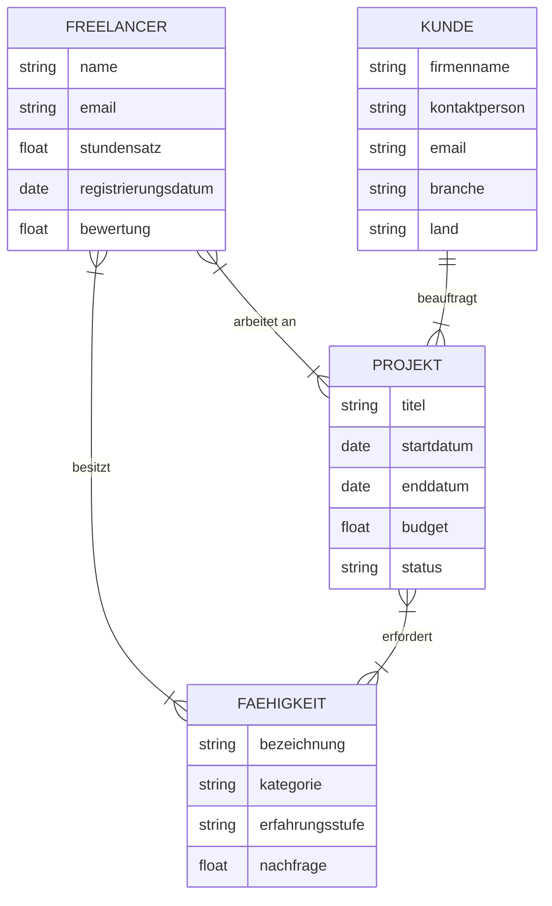
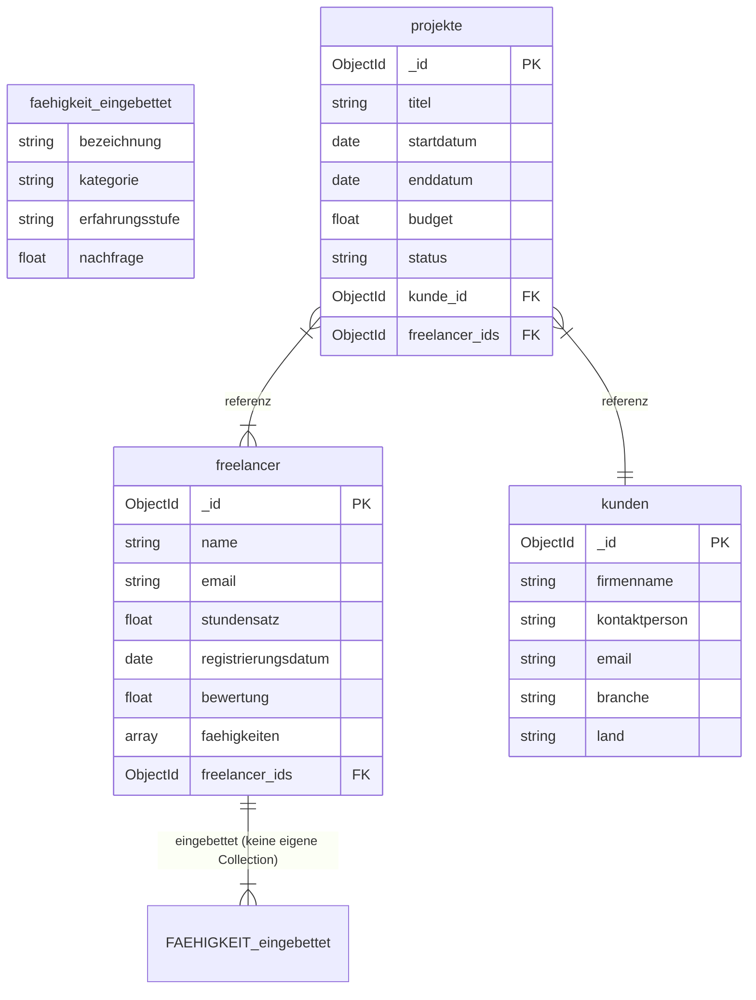

# KN-M-02: Datenmodellierung für MongoDB

**Thema: Freelance-Projektverwaltung**

---

## A) Konzeptionelles Datenmodell (30%)

### Diagramm


[Konzeptionelles Datenmodell](conceptual_model.mermaid)

---

### Entitäten

**Freelancer**
Eine Person, die selbstständig für verschiedene Kunden arbeitet. Jeder Freelancer hat einen Namen, eine E-Mail-Adresse, einen Stundensatz (float), ein Registrierungsdatum sowie eine Durchschnittsbewertung (float). Freelancer können an mehreren Projekten gleichzeitig beteiligt sein und besitzen verschiedene Fähigkeiten.

**Projekt**
Ein Auftrag, der von einem Kunden an einen oder mehrere Freelancer vergeben wird. Ein Projekt hat einen Titel, ein Start- und Enddatum, ein Budget (float) sowie einen Status (z.B. "in Bearbeitung", "abgeschlossen", "pausiert"). Für ein Projekt können spezifische Fähigkeiten vorausgesetzt werden.

**Kunde**
Das Unternehmen oder die Person, welche Projekte in Auftrag gibt. Ein Kunde hat einen Firmennamen, eine Kontaktperson, eine E-Mail-Adresse, eine Branche sowie ein Herkunftsland. Ein Kunde kann mehrere Projekte gleichzeitig laufen haben.

**Fähigkeit**
Eine konkrete Kompetenz, die ein Freelancer besitzen oder die ein Projekt erfordern kann (z.B. "React", "UX-Design", "SEO"). Eine Fähigkeit hat eine Bezeichnung, eine Kategorie (z.B. "Webentwicklung"), eine Erfahrungsstufe sowie einen Nachfragewert (float).

---

### Beziehungen

| Von | Nach | Typ | Beschreibung |
|-----|------|-----|-------------|
| Freelancer | Projekt | **N:N** | Ein Freelancer arbeitet an vielen Projekten; ein Projekt kann mehrere Freelancer haben. |
| Freelancer | Fähigkeit | **N:N** | Ein Freelancer besitzt viele Fähigkeiten; eine Fähigkeit kann von vielen Freelancern besessen werden. |
| Kunde | Projekt | **1:N** | Ein Kunde beauftragt viele Projekte; jedes Projekt gehört genau einem Kunden. |
| Projekt | Fähigkeit | **N:N** | Ein Projekt erfordert mehrere Fähigkeiten; eine Fähigkeit kann von vielen Projekten gefordert werden. |

Die zentrale **N:N-Beziehung** ist jene zwischen Freelancer und Projekt: Ein Freelancer kann an mehreren Projekten gleichzeitig arbeiten, und ein Projekt kann von einem Team aus mehreren Freelancern umgesetzt werden.

---

## B) Logisches Modell für MongoDB (60%)

### Diagramm



---

### Collections und Felder

**Konzeptionell → Logisch:** Die Entität `FAEHIGKEIT` wird nicht zu einer eigenen Collection. Sie wird als eingebettetes Array direkt im `freelancer`-Dokument gespeichert. Dadurch reduziert sich die Anzahl Collections von 4 auf 3.

#### Collection: `freelancer`

| Feld | Datentyp | Beschreibung |
|------|----------|-------------|
| `_id` | ObjectId | Primärschlüssel (automatisch) |
| `name` | string | Vollständiger Name |
| `email` | string | E-Mail-Adresse |
| `stundensatz` | float | Stundenlohn in CHF |
| `registrierungsdatum` | date | Datum der Registrierung auf der Plattform |
| `bewertung` | float | Durchschnittliche Kundenbewertung (1–5) |
| `faehigkeiten` | **[object]** | **Eingebettetes Array** (war Entität FAEHIGKEIT) |
| `faehigkeiten[].bezeichnung` | string | Name der Fähigkeit (z.B. "React") |
| `faehigkeiten[].kategorie` | string | Oberkategorie (z.B. "Webentwicklung") |
| `faehigkeiten[].erfahrungsstufe` | string | Stufe (z.B. "Senior") |
| `faehigkeiten[].nachfrage` | float | Marktnachfrage-Score (0–10) |

#### Collection: `projekte`

| Feld | Datentyp | Beschreibung |
|------|----------|-------------|
| `_id` | ObjectId | Primärschlüssel (automatisch) |
| `titel` | string | Projektbezeichnung |
| `startdatum` | date | Projektbeginn |
| `enddatum` | date | Geplantes Projektende |
| `budget` | float | Gesamtbudget in CHF |
| `status` | string | Status (z.B. "laufend", "abgeschlossen") |
| `kunde_id` | ObjectId | Referenz auf `kunden`-Collection |
| `freelancer_ids` | [ObjectId] | Referenz-Array auf `freelancer`-Collection |

#### Collection: `kunden`

| Feld | Datentyp | Beschreibung |
|------|----------|-------------|
| `_id` | ObjectId | Primärschlüssel (automatisch) |
| `firmenname` | string | Name des Unternehmens |
| `kontaktperson` | string | Ansprechperson |
| `email` | string | E-Mail-Adresse |
| `branche` | string | Branche (z.B. "IT", "Marketing") |
| `land` | string | Herkunftsland |

---

### Erklärung der Verschachtelung

#### `freelancer.faehigkeiten` (eingebettetes Array — aus konzeptioneller Entität FAEHIGKEIT)

**Gewählte Variante:** Embedding als Array

**Begründung:** Im konzeptionellen Modell ist `FAEHIGKEIT` eine eigenständige Entität mit einer N:N-Beziehung zu `FREELANCER`. Im logischen MongoDB-Modell wird diese Entität aufgelöst und direkt als Array in das `freelancer`-Dokument eingebettet. Dies ist sinnvoll, weil:
- Die Fähigkeiten eines Freelancers immer zusammen mit seinem Profil abgerufen werden
- Die Anzahl Fähigkeiten pro Freelancer begrenzt ist (nicht unbeschränkt wachsend)
- Kein Anwendungsfall existiert, bei dem Fähigkeiten unabhängig vom Freelancer abgefragt werden müssen

**Ergebnis:** Statt 4 Collections (wie im konzeptionellen Modell) gibt es im logischen Modell nur noch **3 Collections**. Die N:N-Beziehung FREELANCER–FAEHIGKEIT entfällt, da die Daten direkt eingebettet sind.

---

#### Referenzen (keine Einbettung)

`projekte.freelancer_ids` verwendet eine **Referenz**, weil:
- Freelancer eigenständige Entitäten mit eigenem Lebenszyklus sind
- Ein Freelancer an vielen Projekten arbeiten kann (N:N) — Einbettung würde massive Datenverdopplung erzeugen

`projekte.kunde_id` ist eine **Referenz**, weil ein Kunde mehrere Projekte hat und seine Stammdaten zentral gepflegt werden sollen.

---

## C) Anwendung des Schemas in MongoDB (10%)

### Script

```javascript
db.createCollection("freelancer");
db.createCollection("projekte");
db.createCollection("kunden");
```

[create_collections.js](create_collections.js)

---

### Screenshot


