# KN-M-03: Datenmanipulation und Abfragen I

**Datenbank:** `projektverwaltung`  
**Collections:** `freelancer`, `projekte`, `kunden`

---

## A) Daten hinzufügen – `A_insert.js`

- **3 Kunden** via `insertMany()`
- **4 Freelancer** via `insertMany()` (mit eingebetteten `faehigkeiten`-Arrays)
- **5 Projekte**: 1× `insertOne()` + 4× `insertMany()`
- Alle `_id`-Felder via `new ObjectId()` als Variablen gesetzt
- Referenzen (`kunde_id`, `freelancer_ids`) nutzen die Variablen

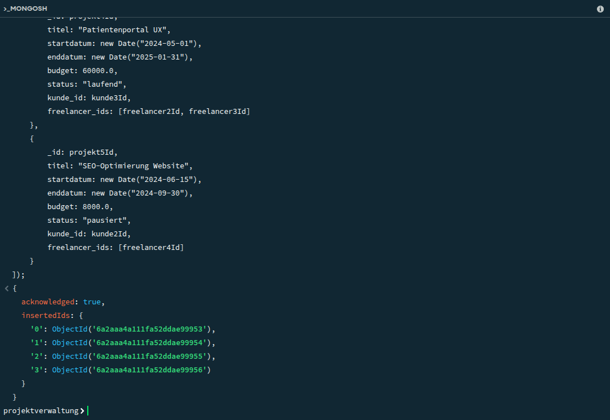

## B) Daten löschen

**B1_drop_all.js** – Löscht alle 3 Collections mit `drop()`

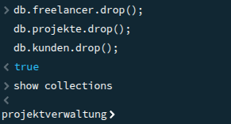

**B2_delete_partial.js**:
- `deleteOne()` auf `kunden` (Filterung auf `_id`)
- `deleteMany()` auf `projekte` mit `$or` auf 2 `_id`s (löscht nicht alle)

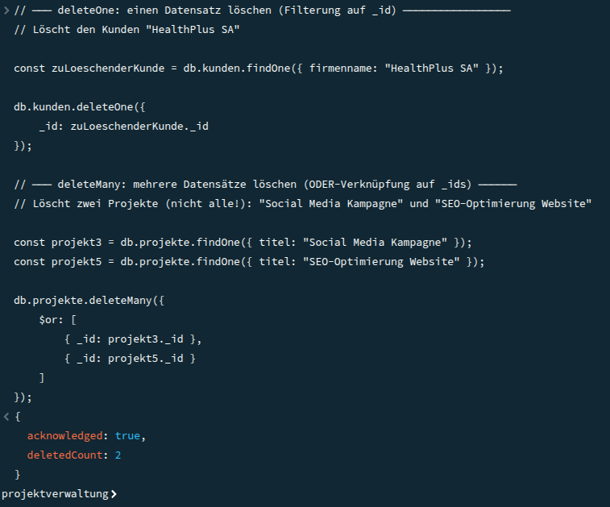

## C) Daten abfragen – `C_queries.js`

| Abfrage | Collection | Besonderheit |
|---------|------------|-------------|
| Land = "Schweiz" | kunden | einfach |
| Land = DE ODER FR | kunden | `$or`, Projektion **mit** `_id` |
| Registrierung < 2022 | freelancer | **DateTime-Filter** |
| Stundensatz > 80 UND Bewertung ≥ 4.5 | freelancer | `$and` |
| E-Mail endet auf ".ch" | freelancer | **Regex**, Projektion **ohne** `_id` |
| Startdatum > 01.03.2024 | projekte | DateTime-Filter |
| Titel enthält "Plattform" oder "Portal" | projekte | **Regex**, Projektion **mit** `_id` |
| Status = "laufend" | projekte | Projektion **ohne** `_id` |

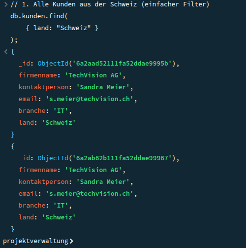
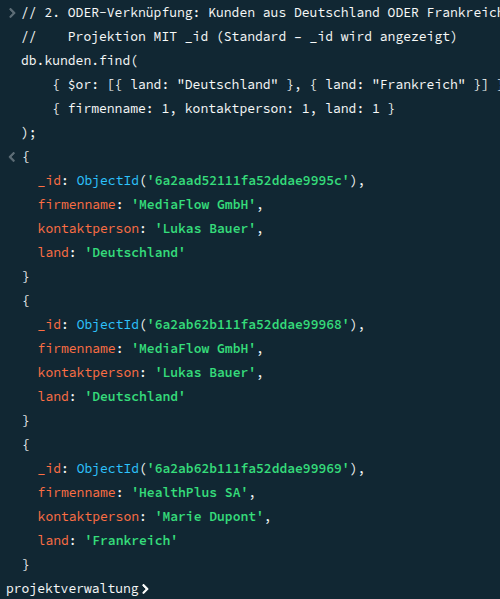
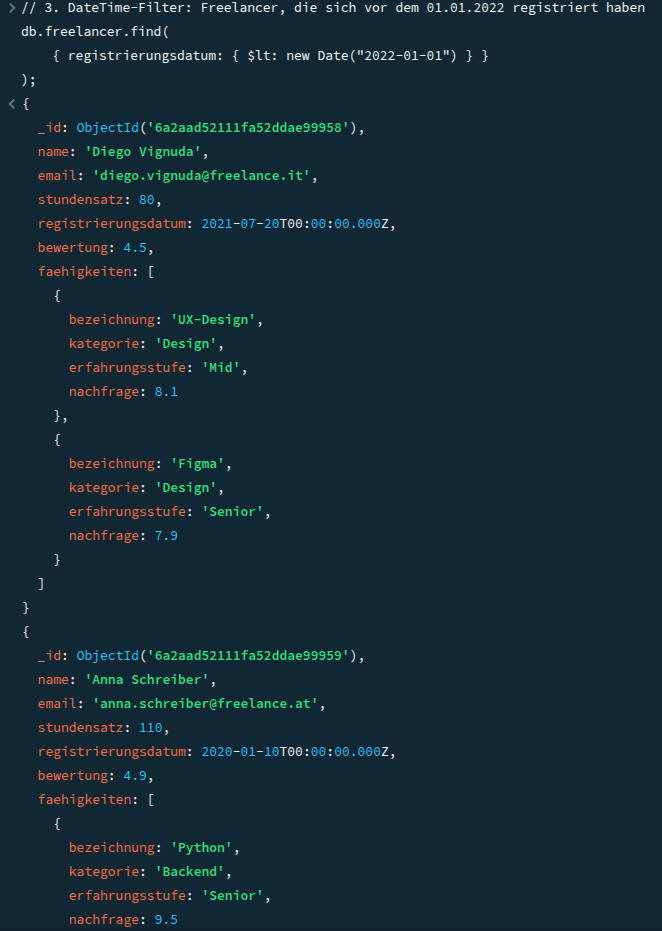
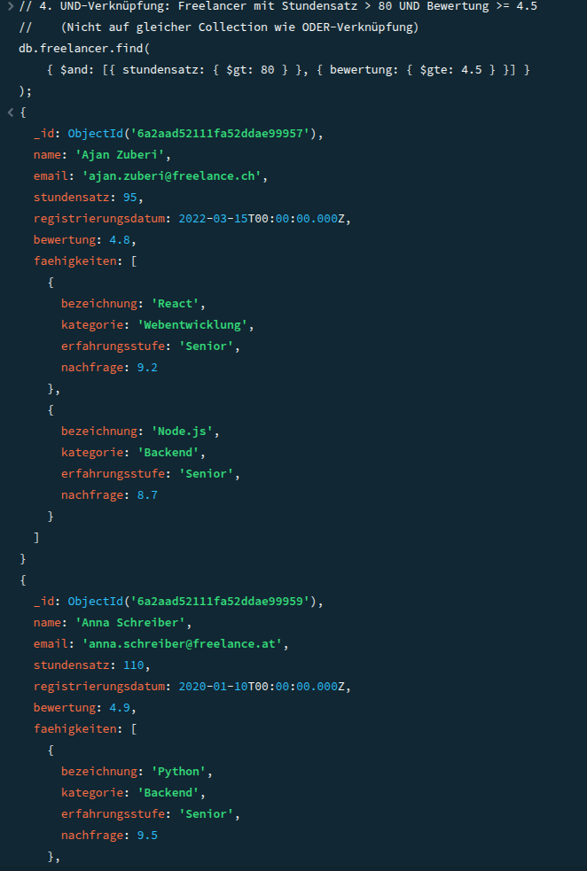
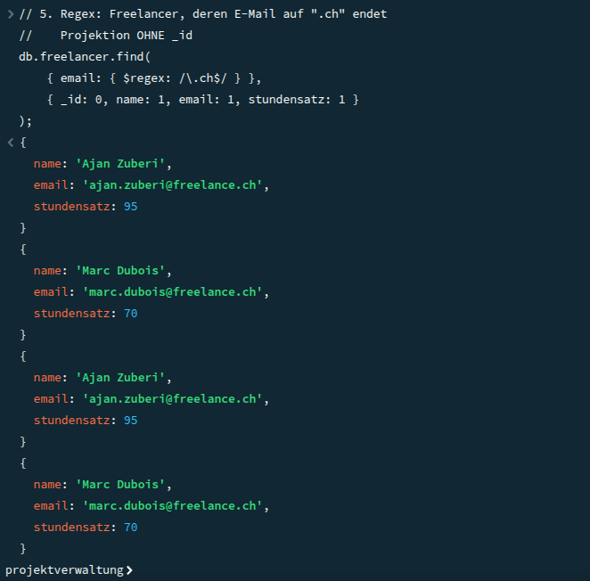
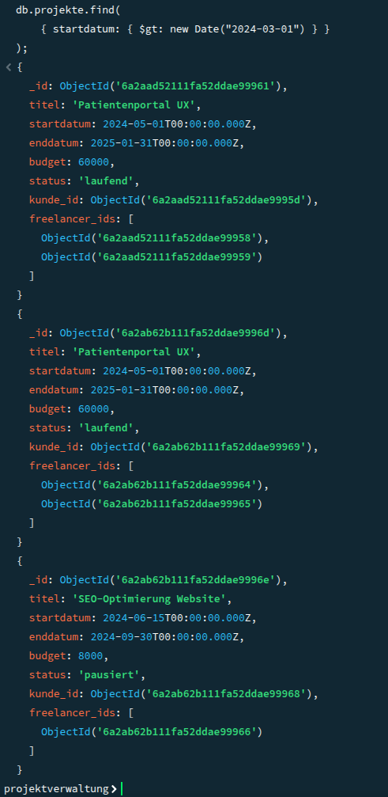
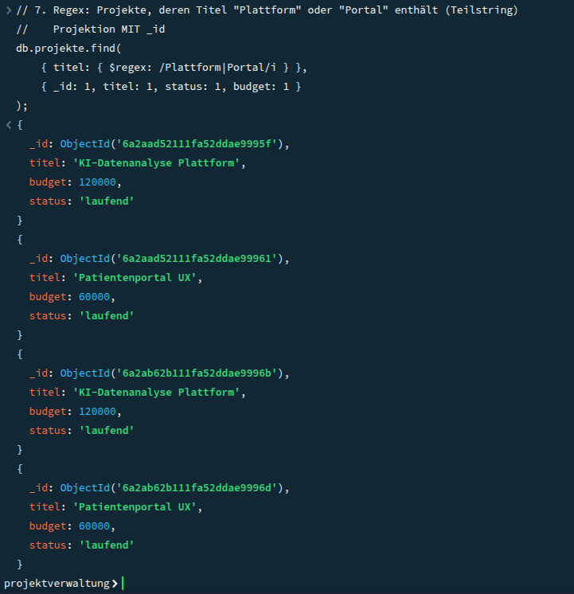
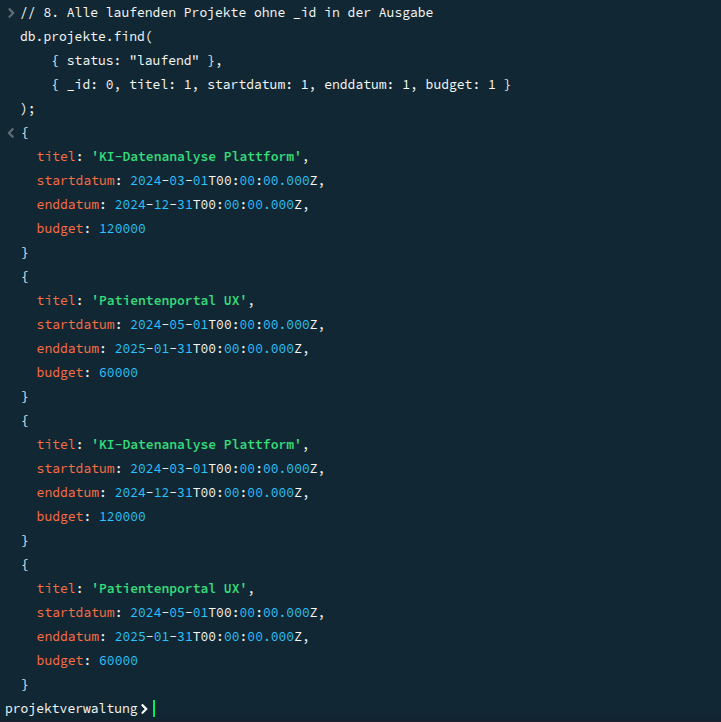

## D) Daten verändern – `D_updates.js`

| Befehl | Collection | Beschreibung |
|--------|------------|-------------|
| `updateOne()` | projekte | Status + Enddatum ändern (Filter: `_id`) |
| `updateMany()` | freelancer | Stundensatz +5 für CH-Freelancer ODER Bewertung < 4.0 (kein `_id`) |
| `replaceOne()` | kunden | Gesamtes Dokument von MediaFlow GmbH ersetzen |

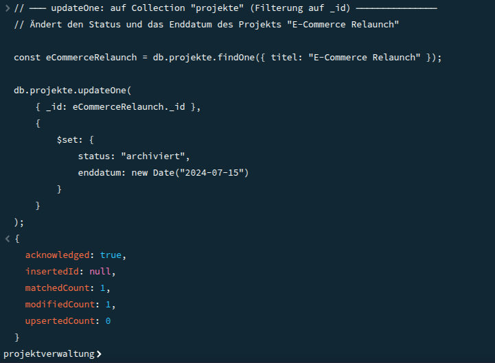
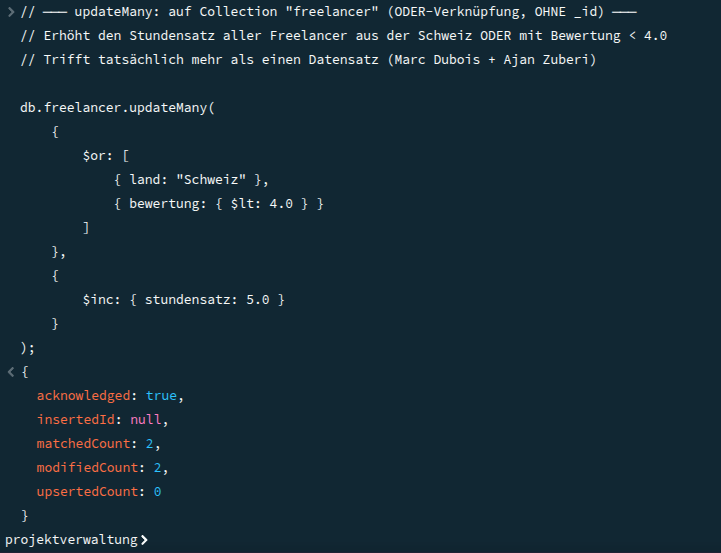
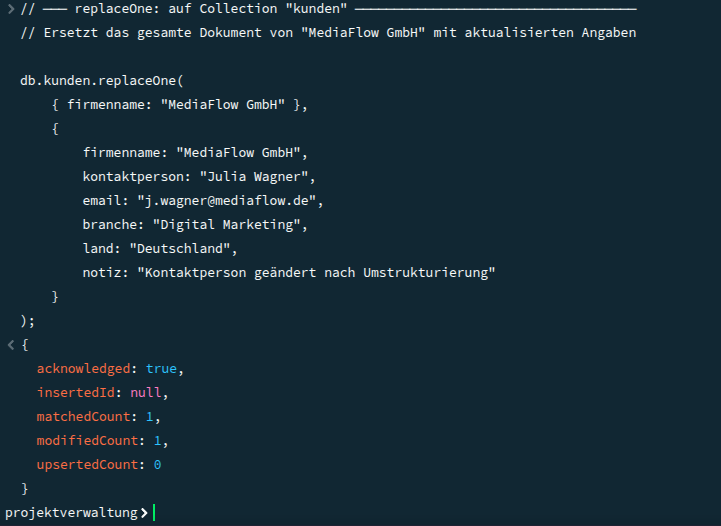

---
